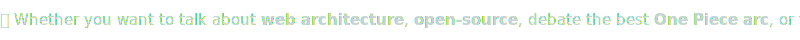

<!-- ╔══════════════════════════════════════════════════════════════════╗ -->
<!-- ║                    Denis Guiraudet · GitHub Profile             ║ -->
<!-- ╚══════════════════════════════════════════════════════════════════╝ -->

<div align="center">

<!-- ─── DYNAMIC HEADER ─── -->


<br/>

<!-- ─── SOCIAL BADGES ─── -->

<a href="https://www.linkedin.com/in/denis-guiraudet/" target="_blank"></a>
<a href="https://github.com/DenisGuiraudet" target="_blank"></a>

<!-- ─── PROFILE VIEWS ─── -->


<!-- ─── PIRATE RABBIT MASCOT ─── -->

<a href="https://denis.guiraudet.fr" target="_blank">
  
</a>

<!-- TODO: WIP re-enable when portfolio is ready
**⬆️ Click the captain to visit <a href="https://denis.guiraudet.fr" target="_blank">Grand Line OS</a> - my pixel-art portfolio! ⬆️** -->

<br/>

</div>

---

<!-- ═══════════════════════════════════════════════════════════════════ -->
<!--                              ABOUT ME                             -->
<!-- ═══════════════════════════════════════════════════════════════════ -->

<div align="center">

### 🧑‍💻 About Me

</div>

Hi! I'm Denis, a Full-Stack Engineer with a **Master's Degree in IT** and **8+ years** of professional experience.

I write software a lot like I play **SimCity**: plan the grid first, lay strong foundations, and make sure the city doesn't catch fire at 3 AM. Much like rushing the right branch of a **Civ tech tree**, investing early in architecture always pays off in the late game.

When I'm not coding, I'm raiding in **WoW**, watching **Anime**, rolling dice in a **tabletop RPG**, or clutching rounds in **Counter-Strike** 🎮

---

<!-- ═══════════════════════════════════════════════════════════════════ -->
<!--                        EPIC GRINDS & CAMPAIGNS                    -->
<!-- ═══════════════════════════════════════════════════════════════════ -->

<div align="center">

### 🗺️ The Developer Journey

I've spent **8+ years** shipping production code. From slaying legacy monoliths to architecting multi-tenant SaaS platforms from scratch.

<br/>
<a href="JOURNEY.md"></a>

</div>

---

<!-- ═══════════════════════════════════════════════════════════════════ -->
<!--                             TECH STACK                            -->
<!-- ═══════════════════════════════════════════════════════════════════ -->

<div align="center">

### 🛠️ Tech Stack

</div>

**Frontend**

&nbsp;
&nbsp;
&nbsp;
&nbsp;
&nbsp;
&nbsp;


**Backend, Data & Testing**

&nbsp;
&nbsp;
&nbsp;
&nbsp;
&nbsp;
&nbsp;
&nbsp;
&nbsp;


**Build & Monorepo**

&nbsp;
&nbsp;
&nbsp;
&nbsp;


**Cloud & DevOps**

&nbsp;
&nbsp;
&nbsp;


**Libraries & Tools**

&nbsp;
&nbsp;
&nbsp;
&nbsp;
&nbsp;


---

<!-- ═══════════════════════════════════════════════════════════════════ -->
<!--                      ENGINEERING & AI PHILOSOPHY                  -->
<!-- ═══════════════════════════════════════════════════════════════════ -->

<div align="center">

### 🧠 How I Build Software

</div>

I don't just ship features, I design systems. The kind where someone onboards 6 months later and actually understands what's going on. Here's the gist:

```diff
- Slap code together until it works
- "I'll document it later" (you won't)
- Design patterns everywhere because it looks smart
+ Separation of concerns & clear module boundaries
+ Specs first: OpenAPI contracts, TypeScript interfaces, schemas
+ Design patterns only when they solve a real problem
+ Documentation, logging & observability from day one
+ Code written for the next developer, not just the compiler
```

**⚙️ DX & Process:** I rely on fast feedback loops (linting, type-checking, hot reload), rock-solid CI/CD, and internal tooling that removes friction for the whole team. If it slows us down or breaks silently, *I'll fix the process before I fix the bug*.

**🤖 My take on AI:** Think of AI like **Nen** in *Hunter x Hunter*, everyone has access to it, but true mastery comes from knowing *how* and *when* to use it. I leverage tools like Claude Code, MCPs, and agent skills daily as force multipliers, but the core architecture decisions always stay mine.

---

<!-- ═══════════════════════════════════════════════════════════════════ -->
<!--                    SIDE PROJECTS & HOMELAB                        -->
<!-- ═══════════════════════════════════════════════════════════════════ -->

<div align="center">

### 🚀 Side Projects & Homelab

</div>

> Every pirate needs a ship, every gamer needs a server. 🏴‍☠️

```bash
denis@homelab:~/projects$ tree -a
.
├── 🏴‍☠️ personal-website/
│   ├── description -> "Gamified 16-bit pixel-art portfolio, full Win95-style desktop OS (Nuxt)"
│   └── url         -> "https://denis.guiraudet.fr"
│
├── ⛏️ minecraft-server/
│   ├── deployment  -> "Ansible-automated Fabric Minecraft server on OVH bare-metal"
│   └── stack       -> "Docker, BlueMap, Portainer, Uptime Kuma, HTTPS"
│
└── 🎬 media-center/
    ├── services    -> "Jellyfin, Sonarr, Radarr, Bazarr, Transmission (VPN-routed)"
    └── monitoring  -> "Traefik, Grafana, Prometheus"

3 directories, 6 files
```

---

<!-- ═══════════════════════════════════════════════════════════════════ -->
<!--                        GITHUB STATISTICS                          -->
<!-- ═══════════════════════════════════════════════════════════════════ -->
<div align="center">

### 📊 GitHub Stats


</div>

---

<!-- ═══════════════════════════════════════════════════════════════════ -->
<!--                     SNAKE CONTRIBUTION GRID                       -->
<!-- ═══════════════════════════════════════════════════════════════════ -->

<div align="center">

### 🐍 Contribution Snake

<picture>
  <source media="(prefers-color-scheme: dark)" srcset="https://raw.githubusercontent.com/DenisGuiraudet/DenisGuiraudet/output/github-contribution-grid-snake-dark.svg" />
  <source media="(prefers-color-scheme: light)" srcset="https://raw.githubusercontent.com/DenisGuiraudet/DenisGuiraudet/output/github-contribution-grid-snake.svg" />
  
</picture>

> 🎮 _Snake animation powered by <a href="https://github.com/Platane/snk" target="_blank">Platane/snk</a>_

</div>

---

<!-- ═══════════════════════════════════════════════════════════════════ -->
<!--                         GET IN TOUCH                              -->
<!-- ═══════════════════════════════════════════════════════════════════ -->

<div align="center">

### 💬 Let's Connect



<a href="mailto:guiraudet@live.fr" target="_blank"></a>
<a href="https://www.linkedin.com/in/denis-guiraudet/" target="_blank"></a>

</div>

---

<div align="center">
  
</div>